# N:N Multi-Select

A Power Apps component framework (PCF) field control for model-driven apps. It edits a **many-to-many (N:N)
relationship** and looks and behaves like the platform's own **multi-select choice** field, so a form can offer related
records the same way it offers choices.

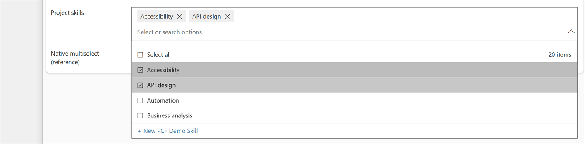

| Item | Value |
| --- | --- |
| Control | `KV.NToNMultiSelect`, display name *N:N Multi-Select*, version 1.0.0 |
| Solution | `NToNMultiSelect` (*N:N Multi-Select*), version 1.0.0.0 |
| Publisher | `KV`, prefix `kv`, choice value prefix 72720 |
| Form library (optional) | Web resource `kv_/NToNMultiSelect/formloader.js`, handler `KVNToNMultiSelectLoader.onLoad` |
| Languages | English and French, following the user's language |
| Documentation | [Technical reference (Word)](docs/NToNMultiSelect%20-%20Technical%20Reference.docx) |
| License | Free to use |

When the environment already has a publisher with the unique name `KV`, the import uses it instead of creating a new
one.

## Contents

* [Features](#features) and [screenshots](#screenshots)
* [Download](#download)
* [Install](#install) and [add the control to a form](#add-the-control-to-a-form)
* [Settings](#settings), including [+ New](#-new-quick-create) and [Copy names into the host column](#copy-names-into-the-host-column)
* [Form library (optional)](#form-library-optional)
* [Messages](#messages), [Upgrade](#upgrade), [Uninstall](#uninstall) and [Troubleshooting](#troubleshooting)
* [Limitations](#limitations) and [Improving the control with a plug-in](#improving-the-control-with-a-plug-in)
* [How it works](#how-it-works), [Repository layout](#repository-layout) and [Build](#build)

## Features

| State | What the user sees (same as the native control) |
| --- | --- |
| Idle | Selected names in bold, comma separated (`---` when empty) |
| Hover | Grey border; the values become chips with an × to remove them |
| Click / focus | Chips, a "Select or search options" box and a chevron. Clicking the box focuses it; the list opens from the chevron, ↓, Enter or typing |
| List | "Select all" with the item count, check-box rows, type to filter |
| Read-only | Grey box with the names, comma separated |

* **Saved immediately.** Each pick is saved as an association straight away (unpicking removes it). The form is never
  made dirty, so required fields elsewhere on the form do not block the change.
* **Subgrids stay in sync.** Subgrids on the form that show the same relationship refresh after a change, and links
  added or removed in those subgrids appear in the control. The control can also take the place of those subgrids
  and hide them.
* **Filtering.** The records offered can be limited with an OData filter, a system view or FetchXML.
* **Large tables.** Up to 500 records load once and are filtered in the browser; larger tables search on the server and
  load more rows as the list scrolls.
* **New records.** Picks made before the first save are linked as soon as the record is saved.
* **Optional extras**: a *+ New* button (quick create), links that open the selected records, a copy of the selected
  names in the host column for views and exports, a selection limit.
* **Accessible.** Full keyboard support, screen reader semantics and Windows high contrast support.

## Screenshots

**Idle.** The selected names in bold. Below it, a native multi-select choice column of the same form for comparison.

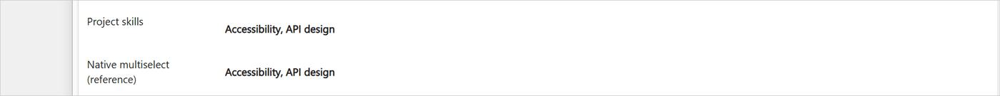

**Pointer over the field.** The values become chips with an × to remove them; with *Open selected records* the names
are links to the records.

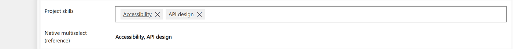

**List open.** Check boxes, selected rows in grey, and *+ New* at the end when quick create is available. The native
multi-select choice list is shown below it for comparison.

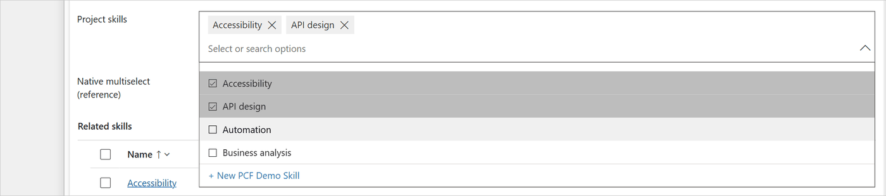

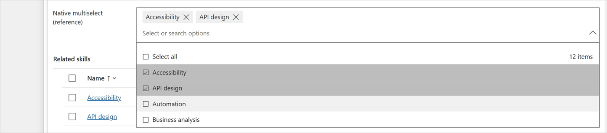

**Typing filters the list**, ignoring case and accents.

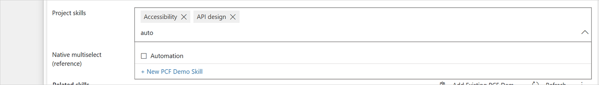

**Saved straight away.** A pick is linked at once, the subgrid of the same relationship shows it, and the form stays
saved.

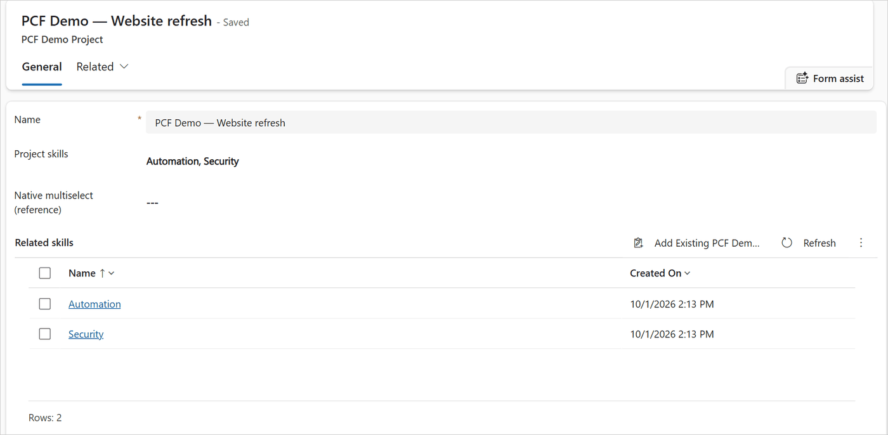

**Many values.** The field keeps one line, like the native control. "+N" shows all values and "less" collapses them.

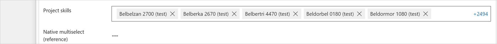

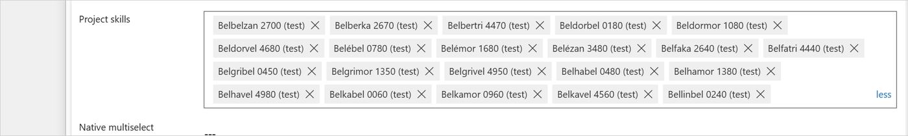

**Large lists.** With more than 500 matching records, the list shows the first 500 and fetches the next 500 when
the user scrolls to the end. Typing then searches on the server.

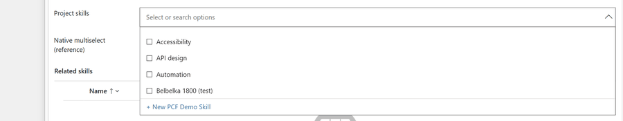

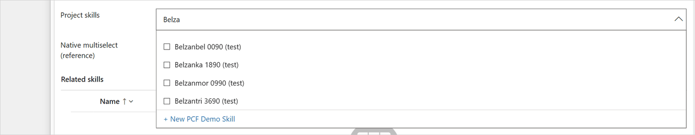

**New records.** Picks made before the first save are held and linked when the record is saved.

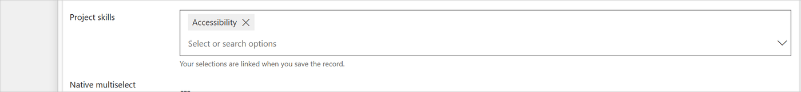

**Read-only.** A grey box with the names (links with *Open selected records*).

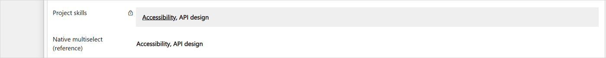

## Download

The solution packages are attached to each release on the [Releases](../../releases) page:

| File | Use |
| --- | --- |
| `NToNMultiSelect_unmanaged.zip` | Unmanaged solution, for development environments |
| `NToNMultiSelect_managed.zip` | Managed solution, for test and production environments |
| `README.txt` | Component names of the build and SHA-256 checksums of the two zip files |
| `NToNMultiSelect - Technical Reference.docx` | Installation, settings, form library, upgrade, uninstall and troubleshooting, step by step with screenshots |

The file names carry no version number; the version is inside the solution. To build the packages from source, see
[Build](#build).

## Install

### Managed or unmanaged

| | Unmanaged (`NToNMultiSelect_unmanaged.zip`) | Managed (`NToNMultiSelect_managed.zip`) |
| --- | --- | --- |
| Use for | Development environments | Test and production environments |
| Components | Can be edited and added to other solutions | Locked; owned by this solution |
| After import | **Publish all customizations** is required | Live immediately |
| Uninstall | Deleting the solution removes only the container; the components stay | Deleting the solution removes the components |

Import only one of the two into a given environment. To ship the control as part of an application solution instead, import
the unmanaged package into the development environment and add the custom control `kv_KV.NToNMultiSelect` (and,
if used, the web resource `kv_/NToNMultiSelect/formloader.js`) to the application solution.

### Import the solution

1. Go to [make.powerapps.com](https://make.powerapps.com) and select the environment. Select **Solutions** (1), then
   **Import solution** (2).

   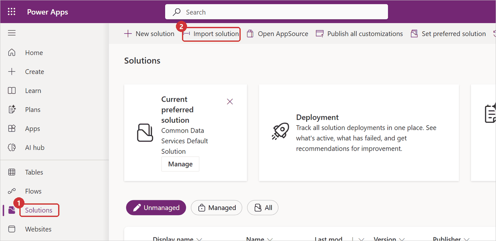

2. In the **Import a solution** panel, select **Browse**.

   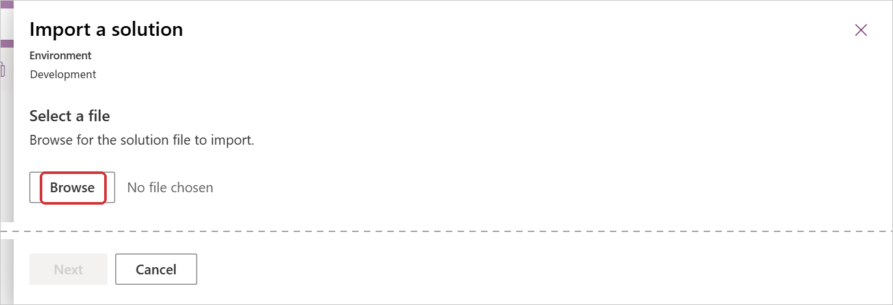

3. Select the zip file (1), then **Next** (2).

   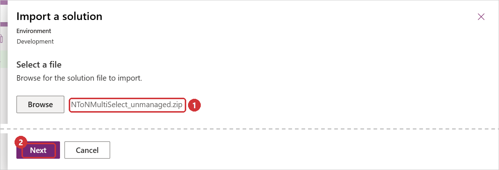

4. Check the type (1), *Unmanaged* or *Managed*, then select **Import** (2).

   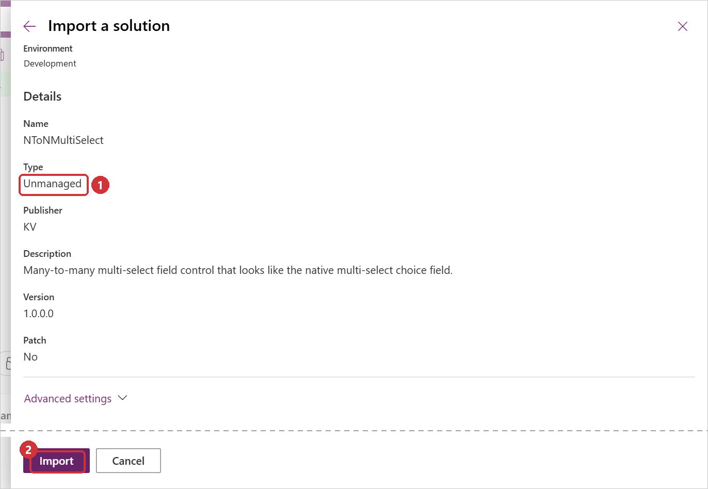

5. Wait for the banner that confirms the import.

   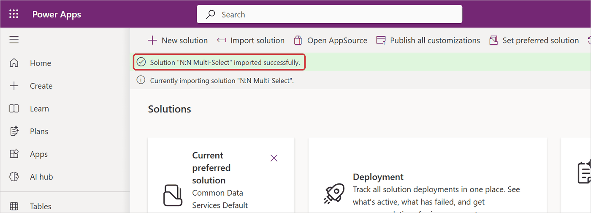

6. For the unmanaged package, select **Publish all customizations**. A managed package is live as soon as the import
   finishes.

   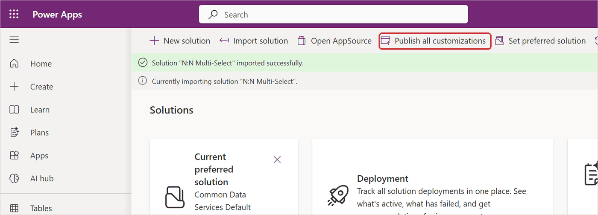

The solution contains the code component and the form library web resource:

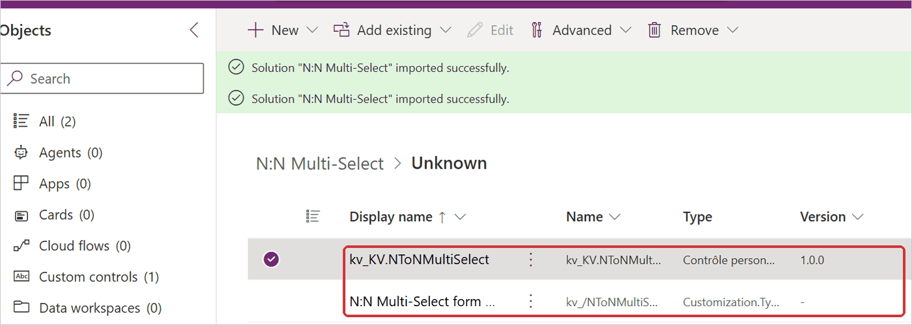

### Add the control to a form

1. **Find the relationship's schema name.** **Tables** → the table of the form → **Relationships** → the
   many-to-many relationship → *Relationship name* (for example `new_project_skill`). Any casing works.
2. **Pick a host column.** The control is placed on a text column of the form's table: *Single line of text*,
   *Text area* or *Multiple lines of text*. The column must **not be Business Required**: the control never sets its
   value on the form, so a required column would block every save. A new single line of text column (for example
   *Project skills*) is the safest choice. If *Copy names into the host column* will be turned on, give the column room
   for all the names (for example 4,000 characters, or *Multiple lines of text*); the copy is cut to the column's
   length.
3. **Open the form** in the form designer and add the host column to the form if it is not already there. Select it.

   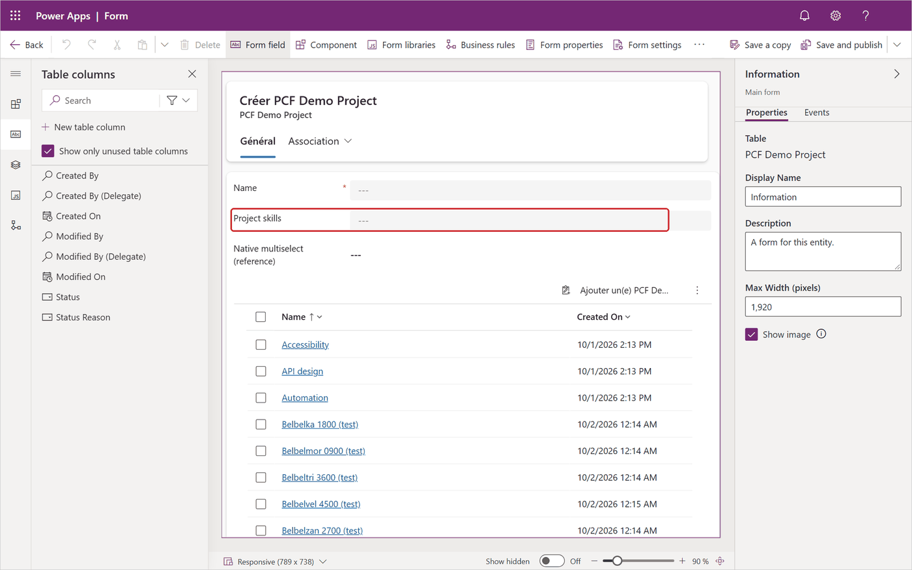

4. **Add the component.** In the column's properties, under **Components**, select **+ Component**.

   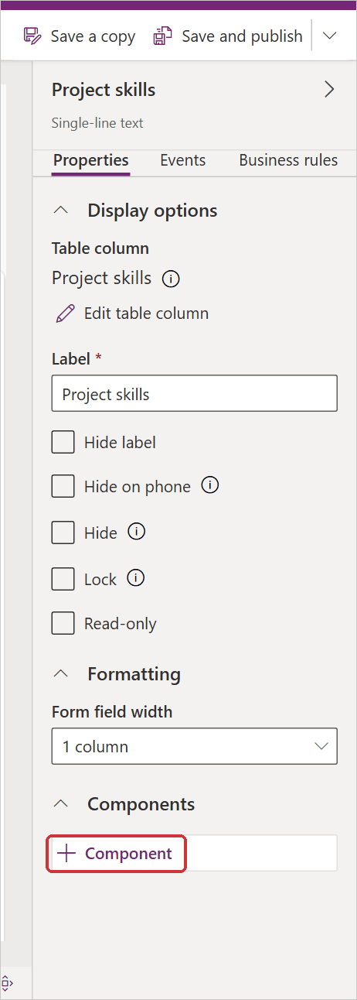

   Select **N:N Multi-Select** (1). When it is not listed, select **Get more components** (2), select
   **N:N Multi-Select** there, then **Add**.

   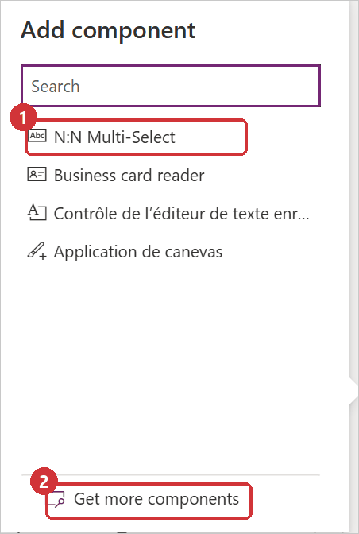 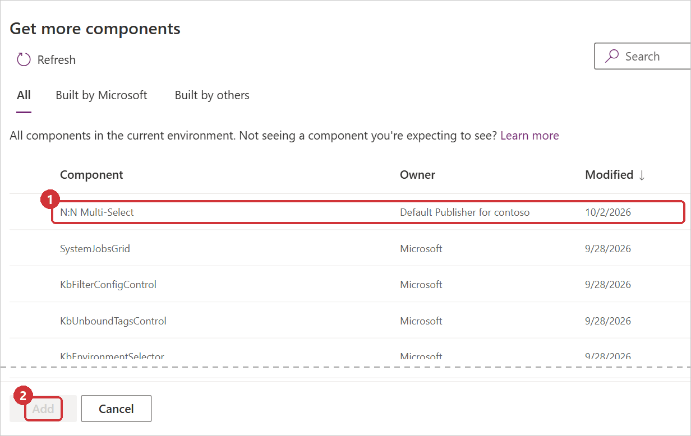

   Enter the **N:N relationship schema name** under *Static value* (leave *Bind to table column* cleared), fill in any
   optional settings (see [Settings](#settings)), choose the clients (Web, Mobile, Tablet), then **Done**. The control is
   listed under the column's components.

   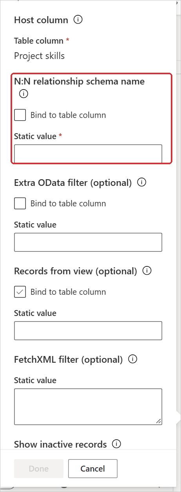 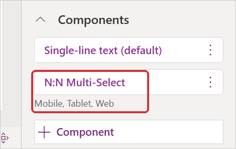

5. **Save and publish** the form.

   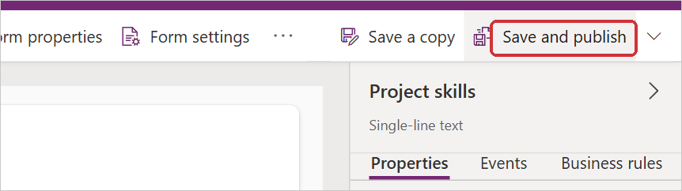
6. Open a record. If the field shows the control, the installation is complete. If it shows "Error loading control",
   add the [form library](#form-library-optional).

**Security roles.** Users need Read on both tables and Append / Append To to link records, Create on the related table
for *+ New*, and Write on the record for *Copy names into the host column*. Without them the control says so and names
the missing privilege.

## Settings

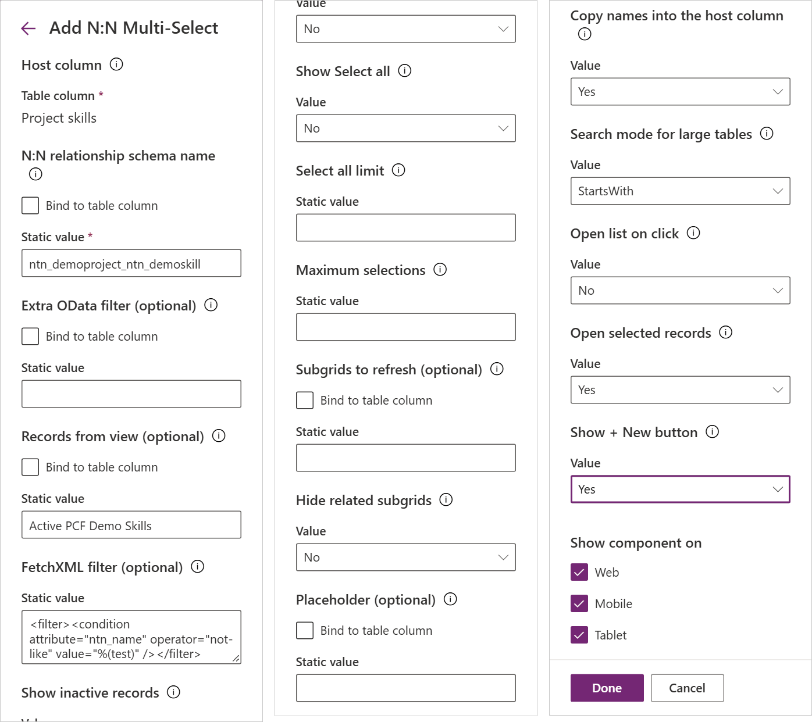

The single-line text settings have *Static value* and *Bind to table column*; *FetchXML filter* takes a static value
only. Leave *Bind to table column* cleared and type the value under *Static value*; it then applies to every record.

| Setting | Default | Description |
| --- | --- | --- |
| Host column | (required) | Text column the control is placed on. Used only as an anchor; must not be Business Required |
| N:N relationship schema name | (required) | The relationship to edit, for example `new_project_skill`. Not case-sensitive |
| Extra OData filter | empty | Limits the records that can be selected, for example `new_category eq 2`. Cannot be combined with a view or FetchXML |
| Records from view | empty | Name or id of a system view of the related table; only records the view returns can be selected. Use the id when view names are translated. See [Choosing which records can be selected](#choosing-which-records-can-be-selected) |
| FetchXML filter | empty | `<filter>` and `<link-entity>` elements that narrow the list (and the view, if set), or a complete `<fetch>` query |
| Show inactive records | No | Also offer inactive records. Ignored with a view or a complete FetchXML query |
| Show Select all | Yes | Shows or hides the Select all row |
| Select all limit | 100 | Select all is offered only when the list holds at most this many records. Maximum 500; 0 means 500 |
| Maximum selections | 0 (no limit) | The most records that can be selected; further rows are greyed out with a hint |
| Search mode for large tables | Starts with | For tables with more than 500 records: *Starts with* (fast on any size) or *Contains* (matches anywhere, slower on very large tables) |
| Open list on click | No | No: as in the native control, clicking focuses the box, and the chevron, the Down arrow key, Enter or typing opens the list. Yes: clicking the box opens the list |
| Open selected records | No | No: as in the native control, the selected values are plain text. Yes: each selected value is a link that opens the record in a new browser tab. Ctrl+click and middle-click work as for any link, Enter opens the chip highlighted with the keyboard (Backspace in the empty search box, then the Left and Right arrow keys), and the links also work when the field is read-only |
| Subgrids to refresh | empty (all subgrids with the same relationship) | Comma-separated subgrid names, or `none` (no refresh, and changes made in subgrids are not followed) |
| Hide related subgrids | No | Yes: the control takes the place of the related subgrids and hides them. See [Subgrids](#subgrids) |
| Placeholder | Select or search options | Text in the empty search box |
| Copy names into the host column | No | Yes: writes "A; B; C" into the host column of the record, with its own update, for views and exports. See [Copy names into the host column](#copy-names-into-the-host-column) |
| Show + New button | No | Yes: adds "+ New ..." at the end of the list, which opens quick create and selects the new record if the list offers it. Only shown when the related table allows quick create |

The same descriptions appear as tooltips in the form designer.

### Choosing which records can be selected

By default every active record of the related table can be selected. Three settings narrow that down:

* **Records from view**: the list shows what a system view of the related table shows. Enter the view's name or id.
  Only the view's filters are used, including filters on related tables; its columns and sort order are ignored (the
  list is always sorted by name). The view decides which records are usable, so *Show inactive records* is ignored.
  In an environment with more than one language, **enter the id**: translated view names differ between languages,
  so a name that works for one user can fail for another. To find the id, open
  `<environment URL>/api/data/v9.2/savedqueries?$select=name&$filter=returnedtypecode eq '<table name>'` in the
  browser; each view comes with its `savedqueryid`. When a name cannot be used, the control's message gives the id of
  the translated view, or lists the table's views with their ids (in full in the browser console).
* **FetchXML filter**: either `<filter>` and `<link-entity>` elements, which are added with AND to the view (or,
  without a view, to a query of the related table that still follows *Show inactive records*), or a complete `<fetch>`
  query of the related table, which then decides on its own. A complete query cannot be combined with a view.
* **Extra OData filter**: a simple condition on the related table's own columns, for example `new_category eq 2`. It
  cannot be combined with a view or FetchXML; put the condition in the FetchXML filter instead.

Example: to offer only technical skills, set **Records from view** to the id of a view that filters on that, or set
**FetchXML filter** to:

```xml
<filter>
  <condition attribute="new_kind" operator="eq" value="1" />
</filter>
```

Here `new_kind` and `1` stand for a choice column of the related table and one of its values.

Records that are already linked but no longer match still show as selected and can be removed; they are just not
offered in the list. Settings that cannot work (a view that does not exist or belongs to another table, a translated
view name, FetchXML that is not valid or queries another table, a complete query together with a view) are explained
in the list and in the browser console. A view's query is read once per page load, so reload the app after changing
the view.

### Subgrids

After the user pauses (about half a second after the last change is saved), each related subgrid is refreshed once
with the standard `gridControl.refresh()`, which reloads the grid's rows without saving the form.

With **Hide related subgrids**, the control hides the subgrids it takes the place of as soon as it starts, including
grids that appear later. It only hides grids that are visible, turning the setting off shows again only the grids it
hid, and a hidden grid is not refreshed. The control does not need the subgrid, so it can also be removed from the
form, or *Visible by default* cleared in its properties, which avoids the grid showing briefly while the form loads.

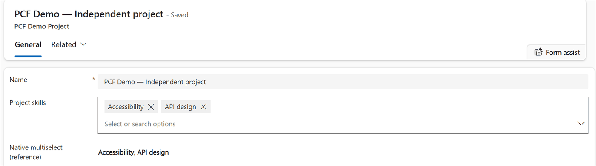

When a saved record is opened in a dialog or a side pane, the control still saves every change, but it does not
refresh, follow or hide that form's subgrids: the platform's form API there describes the page underneath, so the control
leaves all subgrids alone.

### Copy names into the host column

Once a change is saved, the selected names ("A; B; C", sorted as shown and cut to the column's length) are written to
the host column of the record with an update of their own. Plug-ins, flows and auditing on the record see that update,
and the user needs Write on the record. The form is never made dirty, opening a record never writes to it, and a new
record gets its copy once, after its first save has linked the picks.

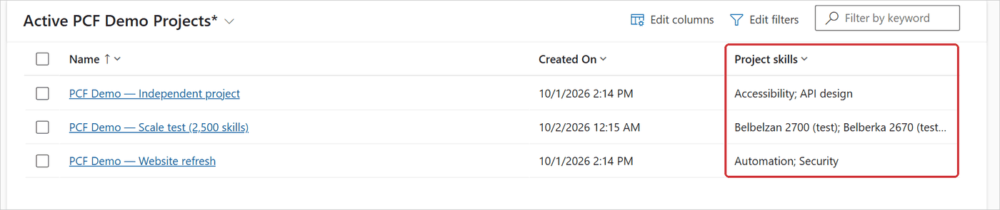

The copy is written only when a record's selection changes, so records linked before the setting was turned on keep a
blank (or old) value until then. Fill them once when the setting goes live, for example with a flow or a script that
writes each record's linked names, sorted by name and separated by `; `.

The copy follows changes made with this control and with subgrids on the same form, but not changes made elsewhere
(imports, integrations, the other side of the relationship), and it includes only records the user can see. For a
column that must always be exact, use a plug-in on Associate and Disassociate instead (it needs the same one-time
fill). A copy that cannot be saved is explained under the field (or in an app notification once the record is closed);
the links stay, and the next change writes the names again.

**Who can read the copy.** The host column is an ordinary column of the record, so anyone who can read the record can
read the copied names (in forms, views, Advanced Find, exports and the Web API), including users whose security roles
or business units hide the related records themselves. The control and the subgrid only ever show a user the related
records they can read, but the copy holds the names the last editor could see. When the related table holds records
that not everyone may see, leave the setting off, or secure the host column with column security (field security) so
that only the right people can read it.

### Open selected records

Each selected value becomes a link that opens the record in a new browser tab (in the mobile app, the record opens in
the app). Ctrl+click and middle-click work as for any link. With the keyboard: Backspace in the empty search box, the
Left and Right arrow keys to move between the values, then Enter.

### + New (quick create)

With **Show + New button**, the list ends with *+ New &lt;related table&gt;*, which opens the related table's quick
create form. The button appears when quick create is enabled for the related table, and is hidden while *Maximum
selections* is reached. To set the table up:

* **Tables** → the related table → **Properties** → **Advanced options** → tick **Leverage quick create form if
  available**.
* Give the table an active form of type **Quick Create** with the columns a new record needs.

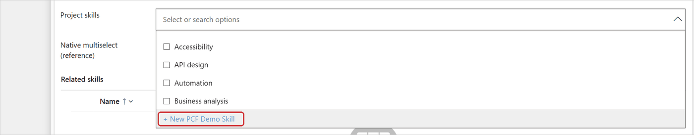

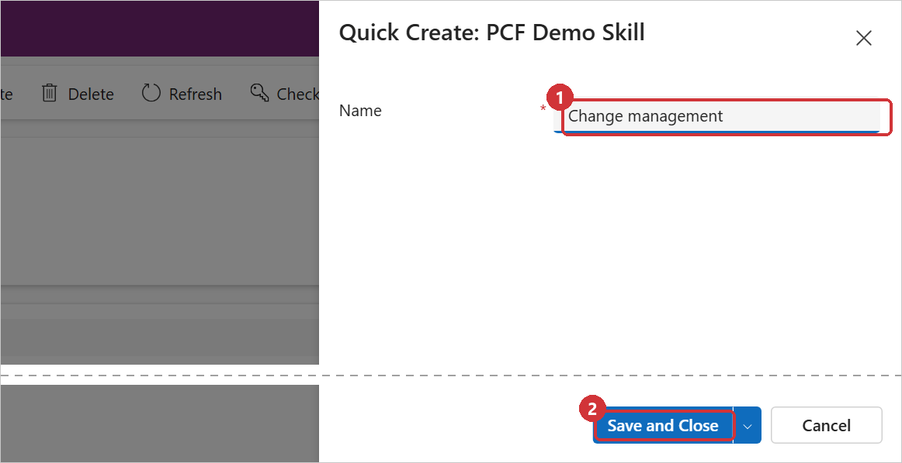

When the new record is saved, it is selected and linked straight away, provided the list offers it (it is active and
matches the view and filters of the field). Otherwise it is created but not selected, and a message under the field
says so.

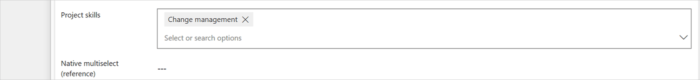

## Form library (optional)

`kv_/NToNMultiSelect/formloader.js` is included in the solution but does nothing unless it is added to a form.

**When it is needed.** Some environments deliver code components to the form without their resources, so the
control's bundle (`cc_KV.NToNMultiSelect/bundle.js`) is never downloaded. The field then shows **"Error loading
control"** and the browser console reports **"Could not find/invoke KV.NToNMultiSelect constructor"**. The form
library fixes this: it downloads the bundle as soon as the form starts loading, and re-creates controls that tried to
start before the bundle arrived (by hiding and showing them, at most twice per control and record).

**When it is not needed.** When the platform loads the control itself, the field works without the library. If the
library is added anyway, it finds the control already registered, or waits up to 10 seconds for the platform's
download before it loads the bundle itself.

**Recommendation.** Add the control to the form without the library first and open a record. Add the library only if
the field shows "Error loading control".

**How to add it:**

1. Open the form in the form designer.
2. **Form libraries** (1) → **+ Add library** (2). Search for `NToNMultiSelect`, select **N:N Multi-Select form
   loader** (`kv_/NToNMultiSelect/formloader.js`), then **Add**.

   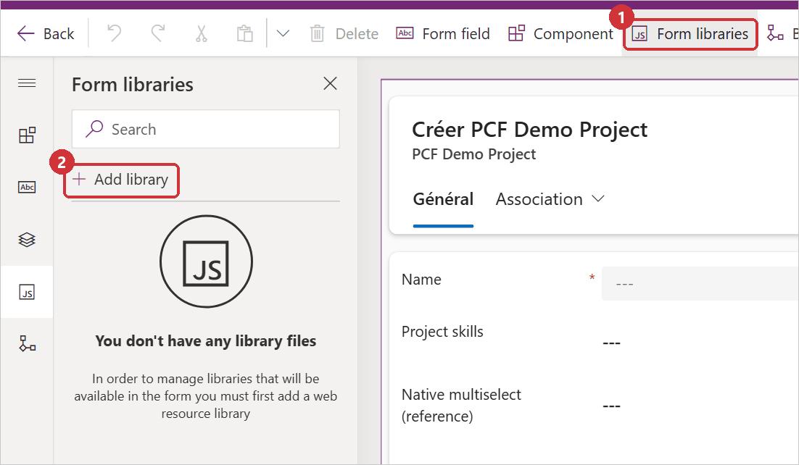 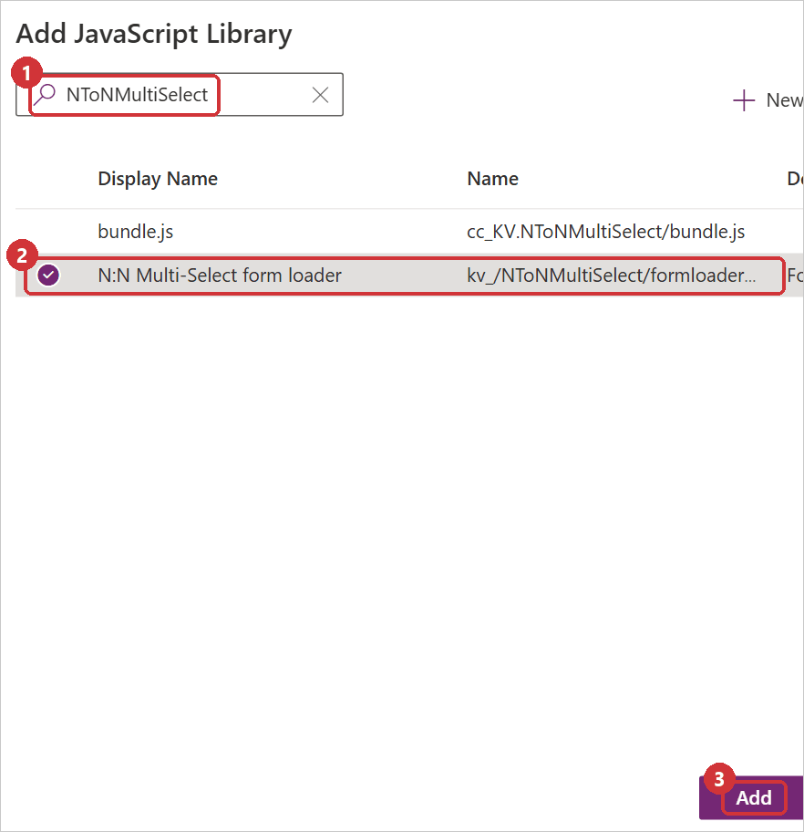

3. Select an empty area of the form, open **Events** (1) and select **+ Event Handler** (2). Set **Event Type** to
   **On Load** and fill in the handler:

   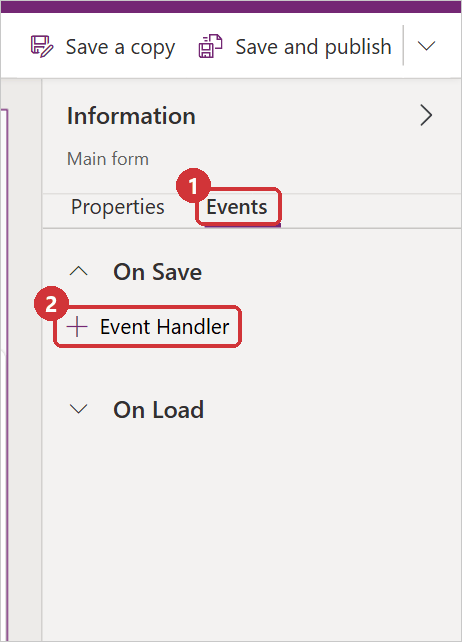 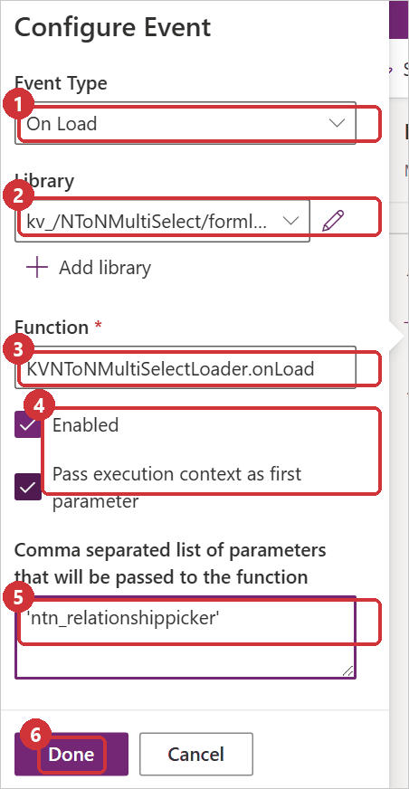

   * **Library**: `kv_/NToNMultiSelect/formloader.js`
   * **Function**: `KVNToNMultiSelectLoader.onLoad`
   * **Enabled**: ticked
   * **Pass execution context as first parameter**: ticked
   * **Comma separated list of parameters**: the logical names of the host columns, in quotes, for example
     `'new_projectskills'`. Without parameters, every control on the form that failed to load is retried.
4. **Done**, then **Save and publish**. The Events tab shows one handler.

   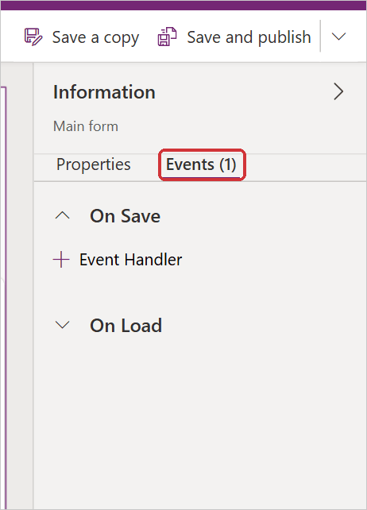

To run without the library, remove the On Load handler and the library from the form, then save and publish.

The bundle injects its own CSS, so the control does not depend on CSS resources either. The build stamps the control
version into the bundle address the library uses, so browsers download the new bundle after an upgrade.

## Upgrade

1. Raise `version` in `control/NToNMultiSelect/ControlManifest.Input.xml` (for example 1.0.1). The build stamps the
   same number into the solution (1.0.1.0) and the form library.
2. Run `node scripts/build.mjs`.
3. Import the new package over the installed solution, the same kind as before (managed over managed, unmanaged over
   unmanaged). For the unmanaged package, select **Publish all customizations** afterwards.

**Always raise the version.** Dataverse does not replace a code component when a solution with the same control
version is imported, so the old bundle would stay in place.

## Uninstall

1. **Remove the control from every form.** On each form that uses it, select the host column → **Components** →
   open the menu (⋮) of *N:N Multi-Select* and select **Delete** (the component's menu, not Delete on the command bar,
   which removes the whole column from the form). If the form library was added, remove its On Load handler and the
   library as well. Save and publish each form.

   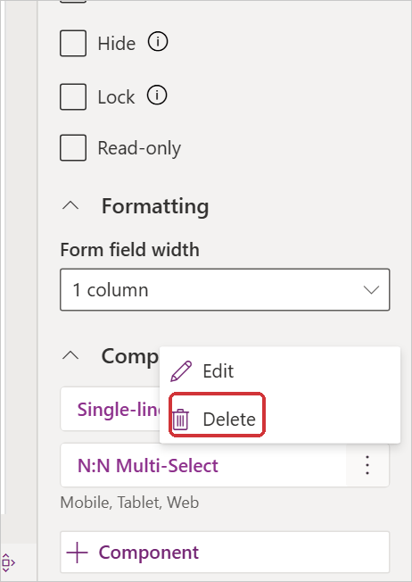
2. **Remove the solution.**
   * Managed: **Solutions** → **Managed** → select *N:N Multi-Select* → **Delete**. This removes the control and the
     web resource.

     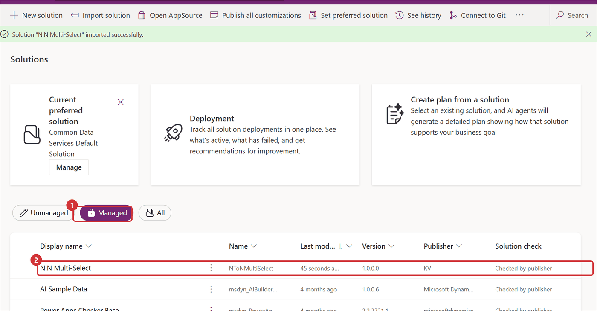
   * Unmanaged: deleting the solution removes only the container. Delete the components themselves first: open the
     solution, select the custom control `kv_KV.NToNMultiSelect` and the web resource
     `kv_/NToNMultiSelect/formloader.js`, choose **Remove** → **Delete from this environment**, then delete the
     solution and select **Publish all customizations**.

     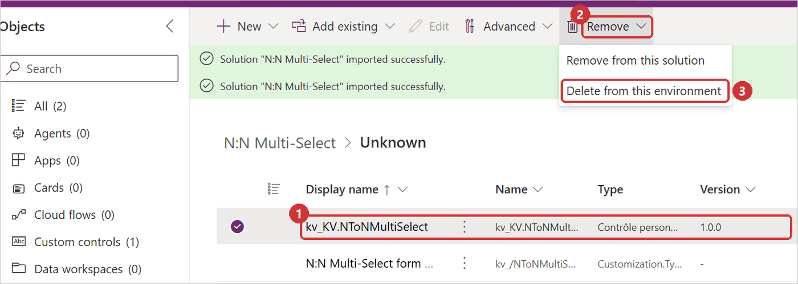

Dataverse refuses the delete while a form still uses a component; **Show dependencies** lists those forms.

Uninstalling does not touch data: the links are stored in the N:N relationship and stay, as does any text in the host
columns. The publisher `KV` stays in the environment and can be deleted separately once no solution uses it.

## Messages

The control explains every problem in the user's language. Problems with a change appear under the field (a change
that fails is undone). Problems with the list appear in the list, including a view, FetchXML filter or Extra OData
filter that cannot work. A missing or wrong relationship name appears in the field itself.
The [technical reference](docs/NToNMultiSelect%20-%20Technical%20Reference.docx) lists every text the control shows,
in English and French (Appendix A). The failures below were produced on purpose in a development environment.

**Connection lost while saving a pick:**

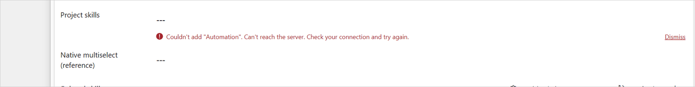

**Missing privilege** (the privilege is named in brackets):

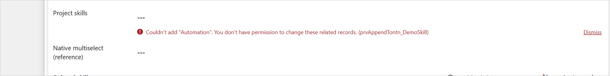

**Throttled by Dataverse** (service protection limits), after the control's own retries:

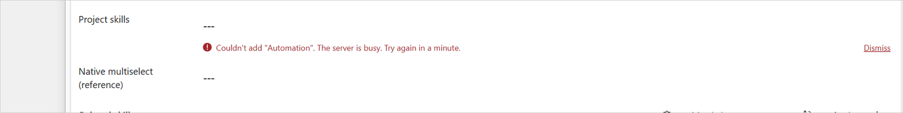

**The link was saved, but the names could not be copied into the host column:**

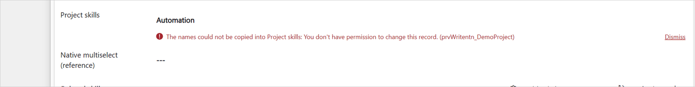

**A record made with + New that the list does not offer:**

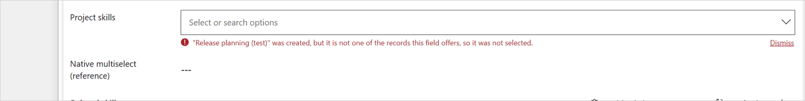

**Maximum selections reached:**

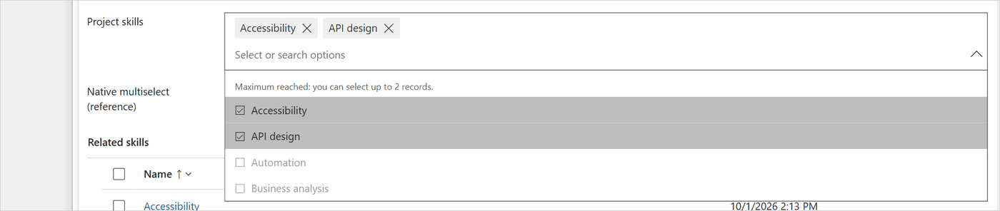

**Settings that cannot work**, for example a wrong relationship name or a view that does not exist (the messages list
the valid names and the views with their ids):

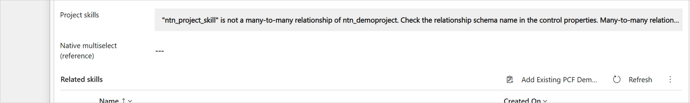

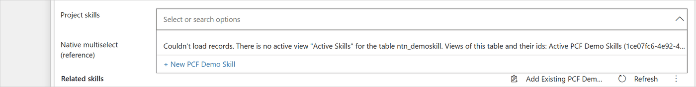

## Troubleshooting

| Symptom | Cause and fix |
| --- | --- |
| An old version of the control (or form) still shows after an update | The browser cached it. Reload with Ctrl+F5. If that is not enough, press F12 → **Application** → **Storage** → **Clear site data** (this signs the user out of that site), then reload |
| "Error loading control"; console: "Could not find/invoke ... constructor" | The environment did not deliver the control's bundle. Add the [form library](#form-library-optional) |
| An update made no difference | The control version was not raised, so Dataverse kept the old bundle. Raise the version, rebuild and import again |
| "... is not a many-to-many relationship of ..." | The schema name is wrong or belongs to another table. The message lists the valid names |
| A view name is not found, or is reported as translated | Enter the view's id instead of its name |
| The form cannot be saved while the field is empty | The host column is Business Required. Use a column that is not required (the console also warns about this) |
| "You don't have permission ..." with a privilege name | The user's security role lacks that privilege (for example `prvAppendToContact`) |

The control logs to the browser console with the prefix `[KV.NToNMultiSelect]`, and the form library with
`[KV.NToNMultiSelect loader]`.

## Limitations

* **Where it runs.** Model-driven app forms (browser, phone and tablet). Not canvas apps, Power Pages, views or
  editable grids.
* **Relationships.** Native many-to-many (N:N) relationships only, one per control. A many-to-many link built from a
  custom table and two one-to-many relationships is not supported.
* **Rules.** The view, the filters, *Show inactive records* and *Maximum selections* apply only in this control.
  Subgrids, imports, flows, integrations and the Web API can still link any record (see the plug-in below).
* **Names copy.** *Copy names into the host column* follows only changes made with this control and with subgrids on
  the same form. Records linked elsewhere, or before the setting was turned on, keep their old text until their
  selection changes here. The text is cut to the column's length and holds only the records the editing user can see.
* **Saving.** Each pick is saved immediately. Discarding the form's other changes does not undo picks. The host
  column's value on the form does not change, so business rules and OnChange scripts on it do not run when records
  are picked.
* **New records.** On new records opened in a dialog or side pane, and on new Appointment, Recurring Appointment and
  Service Activity records, the control shows "Save the record first" and records can be picked once the record is
  saved. On quick create forms, which close when they are saved, the control cannot be used to pick.
* **List.** Only the related table's primary name is shown, sorted by name. On tables with more than 500 matching
  records, search matches the start of the name by default.
* **Select all.** Offered only when every matching record is loaded and their number is within the Select all limit
  (500 at most). Each record is linked with its own request.
* **Dialogs and side panes.** On saved records, changes are saved, but that form's subgrids are not refreshed or
  hidden.
* **Offline.** Read-only in the mobile app's offline mode.
* **Languages.** English and French; other languages show English.
* **Environments.** Some environments need the [form library](#form-library-optional).
* **Updates.** Every update needs a higher control version ([Upgrade](#upgrade)).

## Improving the control with a plug-in

The control needs no server code. Two of its limitations come from running in the browser: the names copy only follows
changes made on the form, and the rules about which records may be linked only apply in the control. A plug-in closes
both gaps, because it runs for every link made anywhere: forms, subgrids, imports, flows, integrations and the Web API.

Links are created and removed with the **Associate** and **Disassociate** messages. These messages cannot be
registered for one table, so a step on them runs for every many-to-many link in the environment. The plug-ins below
check the relationship name first and return at once for any other relationship.

### Keeping the names column exact

This plug-in rebuilds the host column from the current links after every change. When it is used, set *Copy names
into the host column* to **No**, and fill existing records once (for example with a flow).

* Register the assembly with the Plugin Registration Tool (or `pac plugin`). Add two steps: message **Associate** and
  message **Disassociate**, primary table **none**, stage **PostOperation**, synchronous (or asynchronous, if the
  column may lag a few seconds behind).
* Replace the constants with your relationship, its relationship (intersect) table name, the two tables, the host
  column and its maximum length.
* It runs as the system user (`CreateOrganizationService(null)`), so the column holds every linked name. Pass
  `context.UserId` instead to keep only the names the editing user can see. More than 5,000 links per record need
  paging in the query.

```csharp
using System;
using System.Linq;
using Microsoft.Xrm.Sdk;
using Microsoft.Xrm.Sdk.Query;

// Associate and Disassociate, primary table none, PostOperation.
public class CopyLinkedNames : IPlugin
{
    private const string Relationship = "new_project_skill";   // N:N schema name
    private const string IntersectTable = "new_project_skill"; // relationship table name
    private const string HostTable = "new_project";            // table of the form
    private const string HostColumn = "new_projectskills";     // host column
    private const string RelatedTable = "new_skill";
    private const string RelatedName = "new_name";             // primary name column
    private const int MaxLength = 4000;                        // host column length

    public void Execute(IServiceProvider serviceProvider)
    {
        var context = (IPluginExecutionContext)serviceProvider
            .GetService(typeof(IPluginExecutionContext));
        if (!context.InputParameters.TryGetValue("Relationship", out object value)
            || !(value is Relationship relationship)
            || !string.Equals(relationship.SchemaName, Relationship,
                StringComparison.OrdinalIgnoreCase))
        {
            return;
        }

        var target = (EntityReference)context.InputParameters["Target"];
        var related = (EntityReferenceCollection)context
            .InputParameters["RelatedEntities"];
        var hosts = target.LogicalName == HostTable
            ? new[] { target.Id }
            : related.Where(r => r.LogicalName == HostTable).Select(r => r.Id).ToArray();

        var factory = (IOrganizationServiceFactory)serviceProvider
            .GetService(typeof(IOrganizationServiceFactory));
        var service = factory.CreateOrganizationService(null);
        foreach (var hostId in hosts)
        {
            var query = new QueryExpression(RelatedTable);
            query.ColumnSet = new ColumnSet(RelatedName);
            query.AddOrder(RelatedName, OrderType.Ascending);
            var link = query.AddLink(IntersectTable,
                RelatedTable + "id", RelatedTable + "id");
            link.LinkCriteria.AddCondition(
                HostTable + "id", ConditionOperator.Equal, hostId);

            var names = service.RetrieveMultiple(query).Entities
                .Select(e => e.GetAttributeValue<string>(RelatedName));
            var text = string.Join("; ", names);
            if (text.Length > MaxLength) text = text.Substring(0, MaxLength);
            service.Update(new Entity(HostTable, hostId) { [HostColumn] = text });
        }
    }
}
```

### Enforcing the rules on the server

A plug-in on **Associate** in the **PreValidation** stage can refuse links that break a rule, such as inactive
records or too many links. The rule then holds everywhere. When the control makes the link, it undoes the pick and
shows the plug-in's message under the field, for example: *Couldn't add "Security". Only active skills can be linked.*

```csharp
using System;
using System.Linq;
using Microsoft.Xrm.Sdk;
using Microsoft.Xrm.Sdk.Query;

// Associate, primary table none, PreValidation.
public class CheckLinks : IPlugin
{
    private const string Relationship = "new_project_skill";
    private const string RelatedTable = "new_skill";

    public void Execute(IServiceProvider serviceProvider)
    {
        var context = (IPluginExecutionContext)serviceProvider
            .GetService(typeof(IPluginExecutionContext));
        if (!context.InputParameters.TryGetValue("Relationship", out object value)
            || !(value is Relationship relationship)
            || !string.Equals(relationship.SchemaName, Relationship,
                StringComparison.OrdinalIgnoreCase))
        {
            return;
        }

        var factory = (IOrganizationServiceFactory)serviceProvider
            .GetService(typeof(IOrganizationServiceFactory));
        var service = factory.CreateOrganizationService(null);
        var target = (EntityReference)context.InputParameters["Target"];
        var related = (EntityReferenceCollection)context
            .InputParameters["RelatedEntities"];
        var records = related.Concat(new[] { target })
            .Where(r => r.LogicalName == RelatedTable);
        foreach (var record in records)
        {
            var row = service.Retrieve(RelatedTable, record.Id, new ColumnSet("statecode"));
            if (row.GetAttributeValue<OptionSetValue>("statecode").Value != 0)
            {
                throw new InvalidPluginExecutionException(
                    "Only active skills can be linked.");
            }
        }
    }
}
```

Both plug-ins are optional; the control works the same way with or without them.

## How it works

* **Existing records**: each pick is saved immediately through the Web API (at most 4 requests at a time). Rapid
  clicking is collapsed, so add → remove → add sends the minimum number of requests. A write that fails is **rolled
  back** and explained under the field; the rest keep going.
* **New records**: picks are kept until the record's first successful save, then linked automatically (also with
  Save & Close). If the save is blocked (for example, a required field is empty), nothing is linked and the picks stay
  until the save succeeds. On a quick create form, on a new record opened in a dialog or side pane, and on new
  Appointment, Recurring Appointment and Service Activity records, where the save cannot be followed safely, the
  control shows "Save the record first ..." instead of risking links to the wrong record.
* **+ New**: the record made in quick create is selected only when the list offers it (active records, the extra
  filter, the view or the FetchXML filter); otherwise the control says it was created but not selected.
* **Large tables**: up to 500 selectable rows load once and are filtered instantly (ignoring case and accents). Larger
  tables switch to server-side search with paging on scroll (FetchXML paging cookies with a view or FetchXML). Select
  all appears only when every matching row is loaded and the count is within the Select all limit. When the list
  settings change while the form is open (a setting bound to a column), the list reloads, and a page still on its way
  for the old settings is dropped.
* **Metadata**: relationship metadata (and a view's query, when one is set) is read once per page load and kept in
  memory. If it turns out to be out of date (for example, the relationship was renamed), the control reads it again
  once.
* **Resilience**: requests that are throttled (honouring Retry-After), hit a gateway error or lose the connection are
  retried up to 3 times. Reads time out after 2 minutes; writes are given a little longer than the 2-minute plug-in
  limit and are never resent after a timeout. An error that would repeat (no permission, offline, server busy) stops
  the rest of that batch and names the cause. Failures after the record was closed appear as an app notification.
  When the control cannot start because the server could not be reached, it tries again once after 30 seconds
  and when the connection comes back; a setting that cannot work is reported without retrying.
* **Offline**: read-only with a note.
* **Leaving the page**: while a link (or the names copy) is still being saved, closing or reloading the browser tab asks
  for confirmation. Closing the record or hiding the field does not cancel queued writes.
* **Safety**: names are rendered as text (no HTML injection). The control is read-only when the form or the field is
  read-only.
* **Keyboard** (same as native): ↓ or Alt+↓ opens the list with the first row highlighted, Enter opens it or toggles
  the highlighted row, ↑/↓, PageUp/PageDown and Ctrl+Home/End move, Esc closes. Backspace in an empty box moves to the
  chips (←/→ move, Delete/Backspace removes, Enter opens the record with *Open selected records*). Screen readers get
  combobox and listbox semantics and live announcements.

## Repository layout

| Path | Contents |
| --- | --- |
| `control/NToNMultiSelect/ControlManifest.Input.xml` | Control definition and its settings |
| `control/NToNMultiSelect/index.ts` | Controller: settings, loading, saving, new-record handling |
| `control/NToNMultiSelect/src/view.ts` | Rendering: the field, chips, list and keyboard handling |
| `control/NToNMultiSelect/src/styles.ts` | CSS that matches the native multi-select look (injected by the bundle) |
| `control/NToNMultiSelect/src/syncEngine.ts` | Turns picks into associate and disassociate requests (4 at a time, rollback on failure) |
| `control/NToNMultiSelect/src/relatedData.ts` | Web API calls that read and change the relationship |
| `control/NToNMultiSelect/src/fetchQuery.ts` | Builds the list's FetchXML from *Records from view* and *FetchXML filter* |
| `control/NToNMultiSelect/src/metadata.ts` | Resolves tables, columns and navigation properties from the relationship name; finds system views |
| `control/NToNMultiSelect/src/formBridge.ts` | Form integration: subgrid refresh and hiding, OnPostSave for new records |
| `control/NToNMultiSelect/src/namesCopy.ts` | *Copy names into the host column*: the text and its ordered updates of the record |
| `control/NToNMultiSelect/src/dataverse.ts` | Small Web API client (retries, timeouts, throttling) and error messages |
| `control/NToNMultiSelect/src/strings.ts` | All user-facing text, in English and French |
| `control/NToNMultiSelect/src/types.ts` | Shared types and helpers |
| `formloader/formloader.js` | Optional form library (see [Form library](#form-library-optional)) |
| `solution/` | Dataverse solution project: publisher, version and the form library web resource |
| `scripts/build.mjs` | Release build: bundle, both solution packages, copies in `dist/` |
| `dist/` | Built solution packages (not committed; attached to each release) |
| `docs/` | Technical reference (Word) and the screenshots used in this README |

## Build

Requirements: Node.js 20 or later and the .NET SDK 6 or later (for the solution project). The Power Apps build
packages are downloaded from NuGet by the first `dotnet build`; the Power Platform CLI is not needed.

```
cd control
npm ci
npm run refreshTypes
npx tsc --noEmit
npm run lint
cd ..
node scripts/build.mjs
```

`npm run refreshTypes` generates `generated/ManifestTypes.d.ts`, which the type check (`npx tsc --noEmit`) needs;
`npm run lint` runs ESLint with the Power Apps rules. Only `npm ci` and `node scripts/build.mjs` are needed to build.

`scripts/build.mjs` checks the manifest texts (Dataverse rejects apostrophes in them on import), stamps the control
version into the solution and the form library, builds the production bundle, packages the solution with
`dotnet build -c Release` (after removing packages left from an earlier build), checks that the built manifest and
the form library that go into the packages are the current ones, and writes
`dist/NToNMultiSelect_unmanaged.zip` and `dist/NToNMultiSelect_managed.zip`.

## License

This control is free to use.
